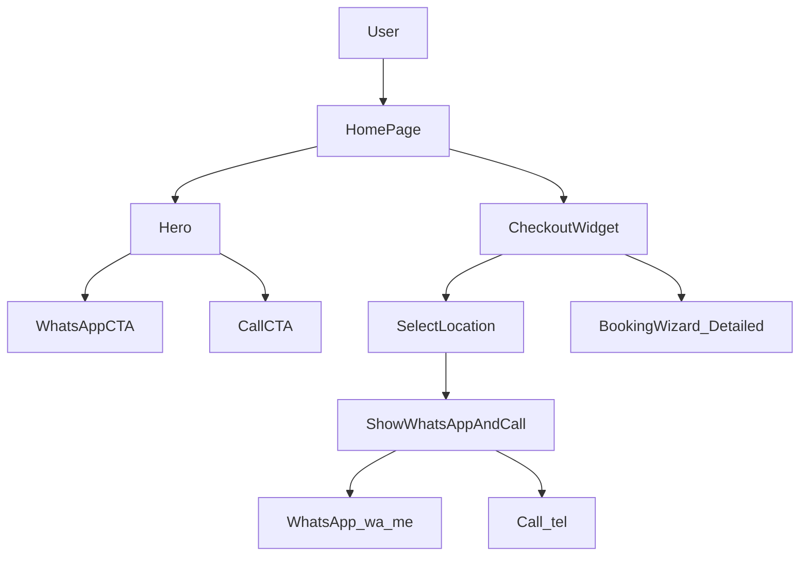

# Janaki-style Hero + Quick Checkout + Rooms Cards

## Reference behavior to mirror

- Reference site: `[srijanakimahaltrustofficial.com](https://www.srijanakimahaltrustofficial.com/)`
- Key UX pattern:
  - **Hero CTAs**: WhatsApp + Call
  - **Homepage booking entry**: a “book/check-out” CTA that leads into **location selection**, then **WhatsApp/Call to book**
  - **Rooms section**: card-style room types (AC/Non-AC, capacity) — pricing optional

## What’s already in this repo

- **Hero** exists at: [src/features/info/components/Hero.tsx](src/features/info/components/Hero.tsx)
- **Booking request wizard** exists at: [src/app/booking/page.tsx](src/app/booking/page.tsx) and [src/features/booking/components/BookingWizard.tsx](src/features/booking/components/BookingWizard.tsx)
- **Locations** + detail pages exist at: [src/app/locations/page.tsx](src/app/locations/page.tsx) and [src/app/locations/[id]/page.tsx](src/app/locations/[id]/page.tsx)
- **WhatsApp/tel plumbing** exists via: [src/data/contact.ts](src/data/contact.ts)

## Proposed UX changes

- **Hero**: swap/augment existing CTAs so the hero prominently includes:
  - **WhatsApp** button → `WHATSAPP_LINK` (optionally with a short prefilled enquiry text)
  - **Call Now** button → `tel:` using `CONTACT_DETAILS.booking.mobile`
- **Under-hero inline “Check Out” widget** (homepageInlineWidget selected):
  - Step A: user selects **Location** (dropdown from `sansthanLocations`)
  - Step B: user clicks **Check Out** → widget reveals **WhatsApp** + **Call** buttons (pre-filled with selected location)
  - Also show a secondary link/button: **“Fill detailed booking request”** → `/booking?location=<id>` (reuses the existing wizard)
- **Rooms section (UI only, no pricing)** (roomsUiNoPricing selected):
  - Add a homepage section with **card-style room types** sourced from `sansthanLocations[].facilities`.
  - Copywriting: “Tariff varies by location; call/WhatsApp for current pricing & availability.”

## Implementation details (files)

- Update hero CTA layout
  - Edit: [src/features/info/components/Hero.tsx](src/features/info/components/Hero.tsx)
  - Reuse: `Button` variants from [src/components/ui/button.tsx](src/components/ui/button.tsx)
  - Reuse: `WHATSAPP_LINK` + `CONTACT_DETAILS` from [src/data/contact.ts](src/data/contact.ts)
- Add inline check-out widget (new component)
  - Add: `src/features/booking/components/BookingCheckoutWidget.tsx`
  - Reuse: `Select` UI from [src/components/ui/select.tsx](src/components/ui/select.tsx)
  - Data: `sansthanLocations` from [src/data/sansthan-data.ts](src/data/sansthan-data.ts)
  - Behavior:
    - local state `locationId`, `showContactOptions`
    - WhatsApp URL builder that appends `?text=` (encodeURIComponent) to `WHATSAPP_LINK`
    - tel link uses sanitized `CONTACT_DETAILS.booking.mobile`
- Place widget under hero on homepage
  - Edit: [src/app/page.tsx](src/app/page.tsx) to render `<BookingCheckoutWidget />` right after `<Hero />`
- Add rooms card section (new component)
  - Add: `src/features/info/components/RoomTypesSection.tsx`
  - Source of truth: `sansthanLocations[].facilities` (grouped by location, or a location filter inside the section)
  - Include CTA buttons (WhatsApp/Call) and a link to `/locations`
- Docs + changelog updates (required)
  - Update: [src/features/info/MODULE_DOC.md](src/features/info/MODULE_DOC.md) (flow diagram + changelog)
  - Update: [src/features/booking/MODULE_DOC.md](src/features/booking/MODULE_DOC.md) (mention checkout widget entry + updated mermaid)

## Updated flow (mermaid)

## Quality checklist (after implementation)

- Run: `npm run lint` and `npm run build`
- Verify on mobile:
  - Hero buttons are large, not clipped by navbar
  - Checkout widget is usable with touch and has clear validation for missing location
  - WhatsApp opens with correct prefilled text + correct number
  - Call button dials correct number
- Ensure no `console.log` usage; keep tracking via existing analytics helpers where relevant.

