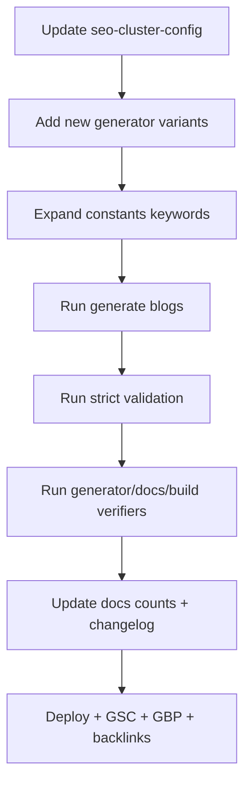

# SEO Plan 4: +100 Blogs + Stronger Topic Authority (Generator-only)

### Current SEO score (practical)

- **On-site SEO readiness**: **~90/100** (technical + content + internal linking are excellent; strict SEO gate passes).
- **Overall ranking readiness**: **~80/100** (remaining gap is mostly **off-site authority**: backlinks, Google Business Profiles + reviews, and real-world CWV/UX signals).

### What’s still “missing” for top rankings (highest impact)

- **Authority signals (off-site)**: backlinks/mentions from pilgrimage/travel sites, local directories, and press.
- **Google Business Profile** (for each location) + review acquisition/response workflow.
- **Production host redirects**: ensure `http→https` and `non-www→www` 301s are enforced at the platform.
- **More exact-match long-tail coverage** (especially bhakta/bhakt niwas + booking/contact variants; Sheogaon/Triambakeshwar spelling intent pages).

---

## Part 1: Add ~100 new blog posts (491 generated / 496 total)

### 1.1 Cluster expansion targets

Update `[scripts/seo-cluster-config.mjs](/home/amansharma/Desktop/DevOPS/Gajanan%20Maharaj%20Sansthan/scripts/seo-cluster-config.mjs)`:

- **Locations**
  - Shegaon: **100 → 115** (+15)
  - Omkareshwar: **75 → 87** (+12)
  - Pandharpur: **55 → 65** (+10)
  - Trimbakeshwar: **55 → 63** (+8)
- **Non-locations**
  - Guides: **58 → 78** (+20)
  - Spiritual: **24 → 32** (+8)
  - Events: **24 → 31** (+7)

Expected generated total: **491** (previous 391 + 100). Publishable total becomes **496** (includes the 5 manual seed posts).

### 1.2 Generator: new topic variants

Edit `[scripts/generate-seo-blog-cluster.mjs](/home/amansharma/Desktop/DevOPS/Gajanan%20Maharaj%20Sansthan/scripts/generate-seo-blog-cluster.mjs)`.

- **Locations (+15 variants)**
  - Add 15 new variants that are **generic for all locations** (usable by Omkareshwar/Pandharpur/Trimbakeshwar up to 87/65/63).
  - Keep Shegaon-only variants **after index 87** so they don’t spill into Omkareshwar when it grows to 87.
  - Implementation detail: split into two arrays and concatenate:
    - `BASE_LOCATION_TOPIC_VARIANTS` (>= 87)
    - `SHEGAON_EXTENSION_VARIANTS` (adds 28 total beyond 87 to reach 115)
- **Guides (+20 slugs)**
  - Add 20 high-intent guide slugs focused on:
    - `bhakta-niwas` / `bhakt-niwas` booking, facilities, rules, cancellations/refunds, check-in/out
    - “Gajanan Maharaj Sansthan” pillar-style guides
    - spelling-intent guides: `sheogaon-*`, `triambakeshwar-*` (as **guides**, not location variants)
- **Spiritual (+8 slugs)**
  - Add 8 devotional posts tied to pilgrimage discipline + seva + temple-stay intent.
- **Events (+7 slugs)**
  - Add 7 festival planning posts (major seasonal searches) with strong booking/crowd-planning intent.

### 1.3 Keywords expansion

Update `[src/lib/seo/constants.ts](/home/amansharma/Desktop/DevOPS/Gajanan%20Maharaj%20Sansthan/src/lib/seo/constants.ts)`:

- **Bhakta/Bhakt Niwas**: room types, check-in/check-out timings, refund/cancellation, online booking, contact-number variants.
- **Spelling variants**: reinforce Sheogaon / Triambakeshwar in long-tail + intent keywords.
- **Routes**: add more city-route long-tails (Vidarbha + MP + Mumbai/Pune/Nashik corridors).

---

## Part 2: Interlinking upgrade (without “link spam”)

### 2.1 Generator: pillar-style guide injection

In `[scripts/generate-seo-blog-cluster.mjs](/home/amansharma/Desktop/DevOPS/Gajanan%20Maharaj%20Sansthan/scripts/generate-seo-blog-cluster.mjs)`:

- Introduce a curated `PILLAR_GUIDE_SLUGS` list (subset of the new guide slugs).
- Ensure each generated post includes **at least 1–2 pillar slugs** in `relatedSlugs` and **1 inline contextual link** to a pillar guide.
- Keep `relatedSlugs` target at **9–10** unless validation shows we need denser linking (avoid over-linking).

### 2.2 Taxonomy and hub prominence

- Keep `/blog` category strip above the fold (already done via `[src/features/blog/components/BlogListingLayout.tsx](/home/amansharma/Desktop/DevOPS/Gajanan%20Maharaj%20Sansthan/src/features/blog/components/BlogListingLayout.tsx)`).
- Add (or expand) a small “Featured posts” block on:
  - `[src/app/blog/category/[category]/page.tsx](/home/amansharma/Desktop/DevOPS/Gajanan%20Maharaj%20Sansthan/src/app/blog/category/%5Bcategory%5D/page.tsx)`
  - `[src/app/blog/tag/[tag]/page.tsx](/home/amansharma/Desktop/DevOPS/Gajanan%20Maharaj%20Sansthan/src/app/blog/tag/%5Btag%5D/page.tsx)`
  using `getPostsBySlugs` (curated pillars) for stronger hub-to-article discovery.

---

## Part 3: Validation, generation, and docs

### 3.1 Generate + validate

- `npm run generate:blogs`
- `npm run validate:blog:strict`
- `npm run verify:generator`
- `npm run verify:docs-sync`
- `npm run build`

### 3.2 Docs updates (must match docs-sync verifier)

Update exact count snippets in:

- `[content/blog/README.md](/home/amansharma/Desktop/DevOPS/Gajanan%20Maharaj%20Sansthan/content/blog/README.md)`
- `[docs/SEO_ROLLOUT_VERIFICATION_REPORT.md](/home/amansharma/Desktop/DevOPS/Gajanan%20Maharaj%20Sansthan/docs/SEO_ROLLOUT_VERIFICATION_REPORT.md)`
- `[docs/SEO_TECHNICAL_IMPLEMENTATION.md](/home/amansharma/Desktop/DevOPS/Gajanan%20Maharaj%20Sansthan/docs/SEO_TECHNICAL_IMPLEMENTATION.md)`
- `[SEO_IMPLEMENTATION_COMPLETE.md](/home/amansharma/Desktop/DevOPS/Gajanan%20Maharaj%20Sansthan/SEO_IMPLEMENTATION_COMPLETE.md)`
- `[src/features/blog/MODULE_DOC.md](/home/amansharma/Desktop/DevOPS/Gajanan%20Maharaj%20Sansthan/src/features/blog/MODULE_DOC.md)`
- Add a changelog entry in `[docs/CHANGELOG.md](/home/amansharma/Desktop/DevOPS/Gajanan%20Maharaj%20Sansthan/docs/CHANGELOG.md)`

---

## Part 4: Post-deploy (ranking-critical)

- Google Search Console: submit sitemap + request indexing on pillars.
- Google Business Profiles for all locations + review pipeline.
- Backlink plan: local directories + travel/pilgrimage sites + partnerships.

---

## Implementation flow

