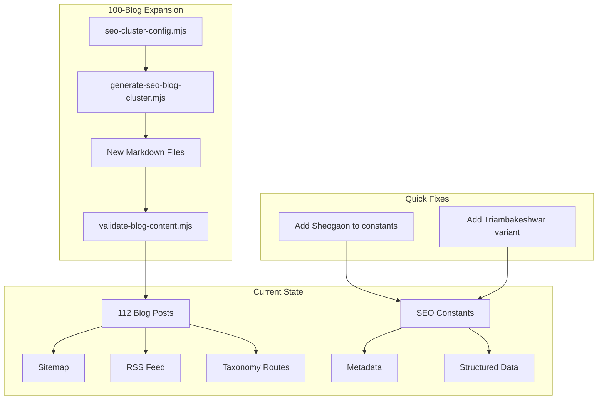

# SEO Audit and 100-Blog Expansion Plan

## Part 1: SEO Score Assessment

### Overall SEO Score: **78/100**

| Category                          | Score | Max | Notes                                 |
| --------------------------------- | ----- | --- | ------------------------------------- |
| Technical SEO                     | 22    | 25  | Strong foundation; minor gaps         |
| Content SEO                       | 18    | 25  | Good structure; volume below target   |
| Local SEO                         | 14    | 15  | Excellent; minor keyword variant gaps |
| User Experience                   | 14    | 15  | Solid; alt text coverage partial      |
| Content Volume & Keyword Coverage | 10    | 20  | Main gap: need 100+ more blogs        |

---

## Part 2: What Is Working Well

### Technical SEO (Strong)

- **Meta tags**: Page-specific titles, descriptions, keywords via `[src/lib/seo/metadata.ts](src/lib/seo/metadata.ts)`
- **Open Graph & Twitter Cards**: Implemented on all pages
- **Canonical URLs**: Enforced via `metadataBase` and `alternates.canonical`
- **Sitemap**: Dynamic `[src/app/sitemap.ts](src/app/sitemap.ts)` includes static routes, locations, blog posts, pagination, tags, categories
- **robots.txt**: Proper rules, sitemap reference, host directive in `[src/app/robots.ts](src/app/robots.ts)`
- **Structured data**: Organization, WebSite, LocalBusiness, PlaceOfWorship, LodgingBusiness, FAQ, Breadcrumb, Article schemas in `[src/lib/seo/structured-data.ts](src/lib/seo/structured-data.ts)`
- **RSS feed**: `[src/app/feed.xml/route.ts](src/app/feed.xml/route.ts)` with all blog posts
- **Canonical host hardening**: www/non-www redirect control in `next.config.ts`

### Content & Blog

- **112 blog posts** across locations (Shegaon 32, Omkareshwar 21, Pandharpur 15, Trimbakeshwar 15, Guides 16, Spiritual 6, Events 6)
- **Blog structure**: Proper frontmatter (title, description, keywords, tags, category, locationIds, relatedSlugs)
- **Internal linking**: Mandatory links to `/locations/*`, `/booking`, `/contact`, and related posts
- **Taxonomy routes**: `/blog/tag/[tag]`, `/blog/category/[category]`, pagination
- **Article schema**: JSON-LD on each blog post

### Local SEO

- **6 Sansthan locations** with geo coordinates, NAP, LocalBusiness schema
- **Location keywords** in `[src/lib/seo/constants.ts](src/lib/seo/constants.ts)` for Shegaon, Pandharpur, Trimbakeshwar, Omkareshwar
- **Brand variants**: Shri/Shree/Sri + Sansthan/Sanstan spellings

---

## Part 3: What Is Missing or Weak

### 1. Keyword Variant Gap: "Sheogaon"

- **Issue**: User searches often use "Sheogaon" (common misspelling). No coverage in constants or content.
- **Fix**: Add "sheogaon", "sheogaon temple", "sheogaon bhakta niwas" to `BRAND_VARIANTS` or `LOCATION_KEYWORDS.shegaon` in `[src/lib/seo/constants.ts](src/lib/seo/constants.ts)`.

### 2. Content Volume Gap

- **Current**: 112 posts
- **Target**: 210+ posts for stronger topical authority and long-tail coverage
- **Gap**: ~100 new blogs needed

### 3. "Bhakta Niwas" / "Bhakt Niwas" Coverage

- **Current**: Present in layout keywords and some location keywords; limited dedicated blog content.
- **Gap**: Need more pillar and cluster posts explicitly targeting "bhakta niwas shegaon", "bhakta niwas booking", "bhakt niwas accommodation".

### 4. Technical Gaps

- **hreflang**: No alternate language tags (e.g., Hindi, Marathi). If multilingual is planned, add `alternates.languages`.
- **Event schema**: Festival/utsav dates could use `Event` schema for rich snippets.
- **Blog image alt**: Ensure `post.image` has descriptive alt in Article schema (currently uses title).

### 5. Minor Content Gaps

- **Triambakeshwar vs Trimbakeshwar**: Both spellings used in search; ensure both appear in keywords and slugs where appropriate.
- **Pandharpur**: 15 posts is decent; can add more Wari, Vitthal-Rukmini, darshan-timing guides.

---

## Part 4: 100-Blog Expansion Strategy

### Target Keywords (Priority Order)

1. **Bhakta Niwas** – bhakta niwas shegaon, bhakta niwas booking, bhakt niwas accommodation, bhakta niwas contact
2. **Gajanan Maharaj Sansthan** – gajanan maharaj sansthan shegaon, gajanan maharaj sansthan booking
3. **Shegaon / Sheogaon** – shegaon temple, sheogaon accommodation, shegaon darshan
4. **Omkareshwar** – omkareshwar bhakt niwas, omkareshwar temple stay, omkareshwar darshan
5. **Trimbakeshwar / Triambakeshwar** – trimbakeshwar accommodation, triambakeshwar jyotirlinga
6. **Pandharpur** – pandharpur temple stay, pandharpur accommodation, pandharpur wari

### Cluster Distribution (100 New Posts)

| Cluster       | Current | Add | New Total | Focus Topics                                                      |
| ------------- | ------- | --- | --------- | ----------------------------------------------------------------- |
| Shegaon       | 32      | 25  | 57        | Bhakta Niwas, Sheogaon variant, Anand Sagar, Visawa, darshan tips |
| Omkareshwar   | 21      | 20  | 41        | Bhakt Niwas Omkareshwar, jyotirlinga yatra, stay guide            |
| Pandharpur    | 15      | 15  | 30        | Wari, Vitthal darshan, math stay, seasonal guides                 |
| Trimbakeshwar | 15      | 15  | 30        | Triambakeshwar variant, Nashik combo, jyotirlinga                 |
| Guides        | 16      | 15  | 31        | Cross-location yatra, booking tips, family pilgrimage             |
| Spiritual     | 6       | 5   | 11        | Teachings, devotion, festival significance                        |
| Events        | 6       | 5   | 11        | Utsav dates, crowd planning, special darshan                      |

### Implementation Approach

**Option A: Extend existing generator** (recommended)

- Update `[scripts/seo-cluster-config.mjs](scripts/seo-cluster-config.mjs)` with new targets (e.g., `shegaon: 57`, `omkareshwar: 41`, etc.).
- Extend `[scripts/generate-seo-blog-cluster.mjs](scripts/generate-seo-blog-cluster.mjs)` with:
  - New topic templates for Bhakta Niwas, Sheogaon spelling, Triambakeshwar variant
  - Deterministic slug generation to avoid duplicates
- Run `npm run generate:blogs` to create new markdown files.
- Run `npm run validate:blog` and `npm run verify:generator` to verify.

**Option B: Manual + semi-automated**

- Create ~30 manually curated pillar posts (Bhakta Niwas, Sheogaon, etc.).
- Use generator for remaining ~70 cluster posts.

### New Blog Topic Examples (Bhakta Niwas Focus)

- "Bhakta Niwas Shegaon – Complete Accommodation Guide"
- "How to Book Bhakta Niwas at Shri Gajanan Maharaj Sansthan"
- "Bhakta Niwas vs Anand Vihar – Which to Choose?"
- "Bhakta Niwas Sheogaon Contact Number and Booking Process"
- "Bhakta Niwas Facilities – Rooms, Amenities, and Rules"

### New Blog Topic Examples (Location Variants)

- "Sheogaon Temple – Darshan and Accommodation Guide"
- "Triambakeshwar Jyotirlinga – Stay and Darshan Tips"
- "Omkareshwar Bhakt Niwas – Sansthan Accommodation Guide"

---

## Part 5: Architecture Overview

---

## Part 6: Recommended Action Order

1. **Quick wins** (1–2 hours): Add Sheogaon and Triambakeshwar keyword variants to `constants.ts`; verify no duplicate slugs.
2. **Generator config** (2–4 hours): Update `seo-cluster-config.mjs` with new targets; add Bhakta Niwas and variant topic templates to generator.
3. **Generate 100 blogs** (automated): Run `npm run generate:blogs`; fix any validation failures.
4. **Validate & deploy**: Run full `npm run seo:check`; deploy; resubmit sitemap to Google Search Console.
5. **Optional**: Add Event schema for festival pages; add hreflang if Hindi/Marathi pages are added.

---

## Part 7: Files to Modify

| File                                                                             | Changes                                                                                 |
| -------------------------------------------------------------------------------- | --------------------------------------------------------------------------------------- |
| `[src/lib/seo/constants.ts](src/lib/seo/constants.ts)`                           | Add Sheogaon, Triambakeshwar variants; expand Bhakta Niwas keywords                     |
| `[scripts/seo-cluster-config.mjs](scripts/seo-cluster-config.mjs)`               | Increase cluster targets (e.g., shegaon: 57, omkareshwar: 41, etc.)                     |
| `[scripts/generate-seo-blog-cluster.mjs](scripts/generate-seo-blog-cluster.mjs)` | Add Bhakta Niwas, Sheogaon, Triambakeshwar topic templates; ensure 100 new unique slugs |
| `[content/blog/README.md](content/blog/README.md)`                               | Update cluster status and totals                                                        |
| `[docs/CHANGELOG.md](docs/CHANGELOG.md)`                                         | Log SEO audit and blog expansion                                                        |

---

## Summary

- **SEO Score: 78/100** – Strong technical and local SEO; main gap is content volume and keyword variant coverage.
- **Missing**: Sheogaon variant, ~100 more blogs, stronger Bhakta Niwas focus, Triambakeshwar spelling variant.
- **Plan**: Extend the existing blog generator, add new topic templates, run generation, validate, and deploy. Quick keyword fixes in `constants.ts` can be done first.

