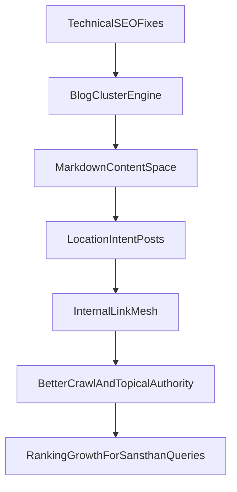

# English SEO Cluster Implementation Plan

## Goal

Increase organic visibility for high-intent queries around `Shri Gajanan Maharaj Sansthan`, `Shegaon`, `Omkareshwar`, accommodation, darshan timings, and nearby places by combining technical SEO hardening + location-focused content clusters.

## What already exists (strong base)

- Metadata, canonical, OG/Twitter helpers in [src/lib/seo/metadata.ts](src/lib/seo/metadata.ts).
- Location structured data in [src/lib/seo/structured-data.ts](src/lib/seo/structured-data.ts).
- Dynamic sitemap in [src/app/sitemap.ts](src/app/sitemap.ts) and robots in [src/app/robots.ts](src/app/robots.ts).
- Markdown blog pipeline in [src/lib/blog/posts.ts](src/lib/blog/posts.ts), [src/lib/blog/parse.ts](src/lib/blog/parse.ts), routes [src/app/blog/page.tsx](src/app/blog/page.tsx), [src/app/blog/[slug]/page.tsx](src/app/blog/[slug]/page.tsx).

Key current limitation to fix first:

```43:56:src/lib/blog/posts.ts
export async function getBlogPosts(): Promise<BlogPost[]> {
  if (!fs.existsSync(CONTENT_DIR)) {
    return [];
  }

  const files = fs.readdirSync(CONTENT_DIR);
```

(Top-level-only scan prevents scalable location/topic folder structure.)

## Implementation scope

### 1) Technical SEO hardening (quick ranking lift)

- Add geo metadata support for location detail pages:
  - extend location model in [src/data/sansthan-data.ts](src/data/sansthan-data.ts) with coordinates.
  - wire geo tags through [src/lib/seo/metadata.ts](src/lib/seo/metadata.ts) and [src/app/locations/[id]/page.tsx](src/app/locations/[id]/page.tsx).
- Add blog listing structured data (`CollectionPage`/`ItemList`) in [src/app/blog/page.tsx](src/app/blog/page.tsx).
- Improve sitemap freshness and breadth in [src/app/sitemap.ts](src/app/sitemap.ts): include new tag/category URLs and accurate post-level timestamps.
- Add canonical redirect hygiene in [next.config.ts](next.config.ts) (domain/path normalization where applicable).

### 2) Full blog content-cluster engine (requested)

- Upgrade blog loader to recursive markdown discovery and richer metadata:
  - [src/lib/blog/posts.ts](src/lib/blog/posts.ts)
  - support nested folders, `category`, `location`, `relatedSlugs`, and helper APIs (`getAllTags`, `getPostsByTag`, `getPostsByCategory`, `getRelatedPosts`).
- Add SEO landing routes:
  - [src/app/blog/tag/[tag]/page.tsx](src/app/blog/tag/[tag]/page.tsx)
  - [src/app/blog/category/[category]/page.tsx](src/app/blog/category/[category]/page.tsx)
- Enhance single post page in [src/app/blog/[slug]/page.tsx](src/app/blog/[slug]/page.tsx): related posts block + stronger internal links to location pages.

### 3) Create dedicated markdown space for SEO blogging

- Create scalable content folders:
  - `content/blog/locations/shegaon/`
  - `content/blog/locations/omkareshwar/`
  - `content/blog/guides/`
  - `content/blog/spiritual/`
- Add authoring template file for fast publishing:
  - `content/blog/_templates/location-seo-post.md`
- Add editorial guide for consistency:
  - `content/blog/README.md` with frontmatter rules, URL slug rules, internal-link requirements, and keyword placement checklist.

### 4) Seed strategic pages/posts for ranking intent

- Create initial high-intent markdown posts (cluster pillars + supporting articles), e.g.:
  - `shegaon-travel-guide`
  - `omkareshwar-darshan-timings`
  - `shegaon-accommodation-guide`
  - `nearby-places-from-shegaon`
- Ensure each post links to:
  - relevant location page (`/locations/...`),
  - booking/contact paths,
  - one pillar + two related cluster posts.

### 5) Documentation + quality gates (workspace rules)

- Update changelog entries in:
  - [src/features/blog/MODULE_DOC.md](src/features/blog/MODULE_DOC.md)
  - [src/features/locations/MODULE_DOC.md](src/features/locations/MODULE_DOC.md)
  - (and other touched module docs)
- Run PR checklist checks before completion:
  - madge cycle check
  - duplicate-file check
  - module docs/changelog sync

## SEO execution flow




## Success metrics (first 8-12 weeks)

- Impressions and clicks increase for location-intent keywords (GSC).
- More indexed pages for tags/categories/location guides.
- Improvement in average position for core terms (`... shegaon`, `... omkareshwar`, `... accommodation`).
- Growth in non-branded organic sessions landing on blog/location pages.

