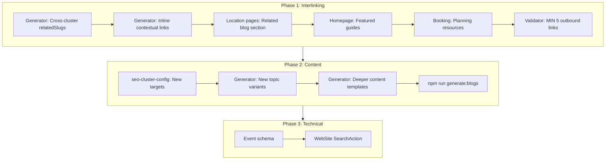

# SEO Plan 2: Robust Interlinking and Content Upgrade

## Context

- **Current state**: 216 blog posts, basic interlinking (neighbor + 2 core slugs, ~3-5 links per post), location pages without blog links, homepage without featured guides.
- **Previous plan gaps**: Event schema, cross-cluster linking, location-to-blog links, content depth, inline contextual links.

---

## Part 1: Interlinking Enhancements

### 1.1 Generator: Stronger relatedSlugs Strategy

**Current**: Each post gets `neighborSlugs` (prev/next in cluster) + 2 from `CORE_RELATED_SLUGS` = ~4 relatedSlugs.

**Proposed**:

- Increase to **6-7 relatedSlugs** per post: neighbor + 2 core + 2-3 cross-cluster pillars.
- Add `CROSS_CLUSTER_PILLAR_MAP` in `[scripts/generate-seo-blog-cluster.mjs](scripts/generate-seo-blog-cluster.mjs)`:
  - Shegaon posts → add `omkareshwar-darshan-timings`, `pandharpur-and-shegaon-family-yatra-plan`
  - Omkareshwar posts → add `shegaon-travel-guide`, `jyotirlinga-and-sansthan-combined-itinerary`
  - Pandharpur posts → add `shegaon-travel-guide`, `pandharpur-and-shegaon-family-yatra-plan`
  - Trimbakeshwar posts → add `trimbakeshwar-nashik-shegaon-route`, `jyotirlinga-and-sansthan-combined-itinerary`
- Update `getCircularNeighborSlugs` to optionally include 2 more siblings (index ± 2) for denser cluster graphs.

### 1.2 Generator: Inline Contextual Links in Body

**Current**: Body has fixed sections: 1 location link, 2 intent links (booking/contact), and a "Related guides" list.

**Proposed**: Add 1-2 inline contextual links in the first or second paragraph, e.g.:

- "For Omkareshwar darshan planning, see our [Omkareshwar Darshan Timings Guide](/blog/omkareshwar-darshan-timings)."
- "Compare [Shegaon vs Anand Vihar accommodation](/blog/shegaon-bhakta-niwas-vs-anand-vihar) before booking."

Template variables: `inlineBlogLink1`, `inlineBlogLink2` (slug + label) passed into `buildLocationPostContent`, `buildCrossLocationGuideContent`, etc.

### 1.3 Location Pages: Related Blog Posts Section

**File**: `[src/app/locations/[id]/page.tsx](src/app/locations/[id]/page.tsx)`

**Proposed**: Add a "Related Guides" section below the main content that:

- Fetches posts with `locationIds` containing the current location id (e.g., `shegaon-bhakt-niwas`).
- Displays 4-6 `BlogCard` links to `/blog/<slug>`.
- Uses `getPostsByLocationId` or filter `getBlogPosts()` by `locationIds`.

**New helper** in `[src/lib/blog/posts.ts](src/lib/blog/posts.ts)`: `getPostsByLocationId(locationId: string, limit?: number)`.

### 1.4 Homepage: Featured Guides Section

**File**: `[src/app/page.tsx](src/app/page.tsx)` or new `FeaturedGuides` component

**Proposed**: Add a "Popular Pilgrimage Guides" section before or after `PlanYourVisit`:

- Fetch 6-8 posts by category/tag (e.g., `shegaon-travel-guide`, `omkareshwar-darshan-timings`, `shegaon-accommodation-guide`, `bhakta-niwas-booking-process`).
- Use `getBlogPost(slug)` for specific slugs or a curated slug list.
- Links to `/blog/<slug>` with keyword-rich anchor text.

### 1.5 Booking Page: Blog Links

**File**: `[src/app/booking/page.tsx](src/app/booking/page.tsx)`

**Proposed**: Add a "Planning Resources" subsection in the FAQ or below it:

- 3-4 links to high-intent posts: `shegaon-accommodation-guide`, `bhakta-niwas-booking-process`, `phone-and-whatsapp-booking-best-practices`.

### 1.6 Validator: Raise Outbound Link Minimum

**File**: `[scripts/validate-blog-content.mjs](scripts/validate-blog-content.mjs)`

- Increase `MIN_GENERATED_OUTBOUND_BLOG_LINKS` from 3 to **5**.
- Add optional check: at least 1 cross-cluster link per generated post (e.g., Shegaon post links to a non-Shegaon slug).

---

## Part 2: Additional Blog Content (50-80 New Posts)

### 2.1 Cluster Expansion Targets

| Cluster       | Current | Add | New Total |
| ------------- | ------- | --- | --------- |
| Shegaon       | 57      | 15  | 72        |
| Omkareshwar   | 41      | 12  | 53        |
| Pandharpur    | 30      | 10  | 40        |
| Trimbakeshwar | 30      | 10  | 40        |
| Guides        | 31      | 15  | 46        |
| Spiritual     | 11      | 8   | 19        |
| Events        | 11      | 10  | 21        |
| **Total**     | 211     | 80  | **291**   |

### 2.2 New Topic Variants

- **Locations**: Add 20+ new `LOCATION_TOPIC_VARIANTS` (e.g., `solo-traveler-guide`, `wheelchair-accessibility`, `medical-facilities-nearby`, `local-markets-and-shopping`).
- **Guides**: Add 15 new `CROSS_LOCATION_GUIDE_VARIANTS` (e.g., `shegaon-omkareshwar-3-day-itinerary`, `pandharpur-wari-accommodation-tips`).
- **Spiritual**: Add 8 new `SPIRITUAL_POST_VARIANTS`.
- **Events**: Add 10 new `EVENT_POST_VARIANTS` (festival-specific: Ram Navami, Diwali, Gudi Padwa, etc.).

### 2.3 Content Depth

- **Validator**: Current warning at &lt;900 chars. Generator content is ~600-800 chars.
- **Proposed**: Extend `buildLocationPostContent`, `buildCrossLocationGuideContent` with:
  - Extra paragraph (100-150 words) with location-specific tips.
  - FAQ-style subsection (2-3 Q&A) for long-tail queries.
  - Ensures ~1000+ chars per post.

---

## Part 3: Technical SEO Upgrades

### 3.1 Event Schema

**File**: `[src/lib/seo/structured-data.ts](src/lib/seo/structured-data.ts)`

- Add `getEventSchema(name, startDate, endDate, location, description)` for festival pages.
- Use on `/blog` posts with `category: "events"` or create a dedicated events data source.

### 3.2 WebSite Schema: SearchAction

**File**: `[src/lib/seo/structured-data.ts](src/lib/seo/structured-data.ts)`

- Extend `getWebSiteSchema()` with `potentialAction` SearchAction pointing to `/blog?q=` (if search exists) or `/blog` for discovery.

### 3.3 Blog Post Schema: speakable (Optional)

- Add `speakable` to Article schema for voice-search optimization (key paragraphs).

---

## Part 4: Implementation Order

---

## Part 5: Files to Modify

| File                                                                             | Changes                                                                                             |
| -------------------------------------------------------------------------------- | --------------------------------------------------------------------------------------------------- |
| `[scripts/generate-seo-blog-cluster.mjs](scripts/generate-seo-blog-cluster.mjs)` | CROSS_CLUSTER_PILLAR_MAP, inline links in templates, 6-7 relatedSlugs, deeper content, new variants |
| `[scripts/seo-cluster-config.mjs](scripts/seo-cluster-config.mjs)`               | New targets (80 more posts)                                                                         |
| `[scripts/validate-blog-content.mjs](scripts/validate-blog-content.mjs)`         | MIN_GENERATED_OUTBOUND_BLOG_LINKS = 5, optional cross-cluster check                                 |
| `[src/app/locations/[id]/page.tsx](src/app/locations/[id]/page.tsx)`             | Related blog posts section                                                                          |
| `[src/lib/blog/posts.ts](src/lib/blog/posts.ts)`                                 | `getPostsByLocationId(locationId, limit)`                                                           |
| `[src/app/page.tsx](src/app/page.tsx)`                                           | Featured guides section                                                                             |
| `[src/app/booking/page.tsx](src/app/booking/page.tsx)`                           | Planning resources links                                                                            |
| `[src/lib/seo/structured-data.ts](src/lib/seo/structured-data.ts)`               | Event schema, WebSite SearchAction                                                                  |
| `[content/blog/README.md](content/blog/README.md)`                               | Updated totals                                                                                      |
| `[docs/CHANGELOG.md](docs/CHANGELOG.md)`                                         | Plan 2 changelog                                                                                    |

---

## Part 6: Expected Outcomes

- **Interlinking**: 5-7 blog links per post, cross-cluster pillars, location pages and homepage linking to blog.
- **Content**: 291 total posts, ~1000+ chars per post, FAQ subsections.
- **Technical**: Event schema for festivals, WebSite SearchAction.
- **SEO score**: Target 85-90/100 (from 78).

