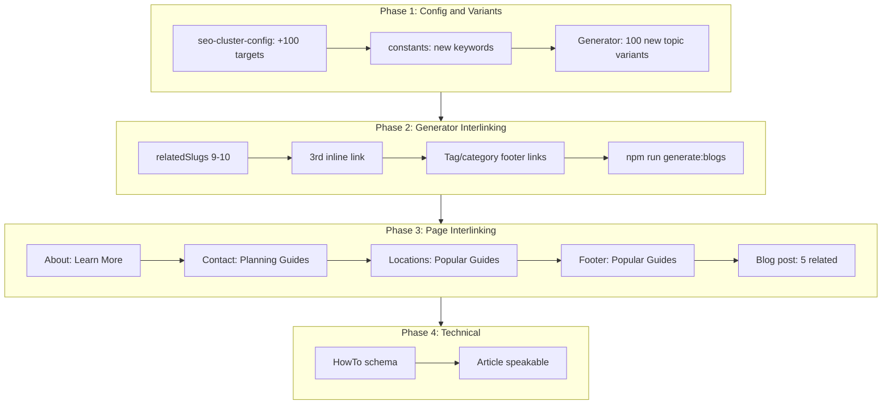

# SEO Plan 3: 100 More Blogs and Enhanced Interlinking

## Context

- **Current state**: 296 posts (291 generated), cross-cluster interlinking, location/homepage/booking blog links, MIN 5 outbound links, WebSite SearchAction.
- **Target**: 396 posts (391 generated), denser interlinking, new page-to-blog links, expanded keyword coverage.

---

## Part 1: 100 Additional Blog Posts

### 1.1 Cluster Expansion Targets

| Cluster       | Current | Add | New Total |
| ------------- | ------- | --- | --------- |
| Shegaon       | 72      | 28  | 100       |
| Omkareshwar   | 53      | 22  | 75        |
| Pandharpur    | 40      | 15  | 55        |
| Trimbakeshwar | 40      | 15  | 55        |
| Guides        | 46      | 12  | 58        |
| Spiritual     | 19      | 5   | 24        |
| Events        | 21      | 3   | 24        |
| **Total**     | 291     | 100 | **391**   |

### 1.2 New Topic Variants

- **Locations** (28 new): Need 100 variants for Shegaon. Current ~72. Add 28+ (e.g., `buldhana-district-guide`, `akola-to-shegaon-route`, `jalgaon-pilgrimage-route`, `maharashtra-temple-circuit`, `anand-sagar-visit-guide`, `visawa-accommodation-tips`).
- **Guides** (12 new): `maharashtra-pilgrimage-circuit`, `buldhana-temple-stays`, `nashik-trimbakeshwar-shegaon-route`, etc.
- **Spiritual** (5 new), **Events** (3 new).

### 1.3 Keyword Expansion in Constants

Add to `[src/lib/seo/constants.ts](src/lib/seo/constants.ts)`:

- **Regional**: `buldhana temple`, `maharashtra pilgrimage`, `vidarbha temple stay`, `akola to shegaon`, `jalgaon to shegaon`
- **Location variants**: `anand vihar shegaon`, `visawa shegaon`, `anand sagar shegaon`
- **Long-tail**: `gajanan maharaj sansthan contact number`, `shegaon temple phone number`, `bhakta niwas online booking`

---

## Part 2: Enhanced Interlinking

### 2.1 Generator: Denser relatedSlugs

- Increase from 7 to **9-10 relatedSlugs** per post.
- Add 3rd inline contextual link in body.
- Add `TERTIARY_PILLAR_SLUGS` for guides/spiritual/events (e.g., location posts also link to `phone-and-whatsapp-booking-best-practices`).

### 2.2 About Page: "Learn More" Section

**File**: `[src/app/about/page.tsx](src/app/about/page.tsx)`

- Add "Explore Our Guides" section below Values.
- Fetch 4-5 posts via `getPostsBySlugs` (e.g., shegaon-travel-guide, about Sansthan history, welcome-to-sansthan).
- Links to `/blog/<slug>` with keyword-rich anchors.

### 2.3 Contact Page: "Planning Guides" Section

**File**: `[src/app/contact/page.tsx](src/app/contact/page.tsx)`

- Add "Planning Guides" section with 3-4 links: `phone-and-whatsapp-booking-best-practices`, `shegaon-bhakta-niwas-booking-process`, `sansthan-contact-numbers-all-locations`, `contact-and-support-guide`.

### 2.4 Locations Listing Page: "Popular Guides by Location"

**File**: `[src/app/locations/page.tsx](src/app/locations/page.tsx)`

- Add section "Popular Guides by Location" below the location grid.
- 4-6 BlogCards fetched by location (e.g., 2 Shegaon, 1 Omkareshwar, 1 Pandharpur, 1 Trimbakeshwar) using `getPostsByLocationId` for first location or curated slugs.

### 2.5 Footer: "Popular Guides" Links

**File**: `[src/components/layout/Footer.tsx](src/components/layout/Footer.tsx)`

- Add "Popular Guides" column or subsection with 4-5 static links to high-value posts (`/blog/shegaon-travel-guide`, `/blog/omkareshwar-darshan-timings`, `/blog/booking`, etc.).

### 2.6 Blog Post Page: More Related Posts

**File**: `[src/app/blog/[slug]/page.tsx](src/app/blog/[slug]/page.tsx)`

- Increase `getRelatedPosts(post, 3)` to `getRelatedPosts(post, 5)`.
- Add "Browse by Category" links (to `/blog/category/locations`, etc.) when post has category.

### 2.7 Blog Listing: "Browse by Category" Prominent Links

**File**: `[src/features/blog/components/BlogListingLayout.tsx](src/features/blog/components/BlogListingLayout.tsx)` or `[src/app/blog/page.tsx](src/app/blog/page.tsx)`

- Ensure category links are above the fold or in a highlighted strip for stronger internal linking to taxonomy pages.

### 2.8 Validator: Optional MIN 7 Outbound Links

- Consider raising `MIN_GENERATED_OUTBOUND_BLOG_LINKS` from 5 to **7** for new posts (or keep at 5 if 9-10 relatedSlugs + 3 inline = 12+ links already).

---

## Part 3: Technical SEO Upgrades

### 3.1 HowTo Schema for Guide Posts

**File**: `[src/lib/seo/structured-data.ts](src/lib/seo/structured-data.ts)`

- Add `getHowToSchema(title, description, steps[])` for guide-style posts.
- Use on blog posts where `category === "guides"` (optional, or add `schemaType` to frontmatter).

### 3.2 Article Schema: speakable (Optional)

- Add `speakable` to `getArticleSchema` for voice search: include first 1-2 paragraphs as speakable content.

### 3.3 Blog Post: Tag/Category Links in Body

- Generator: Add "Browse more in [Category](/blog/category/locations)" and "Tags: [shegaon](/blog/tag/shegaon)" links in a footer section of each post for taxonomy discovery.

---

## Part 4: Implementation Order

---

## Part 5: Files to Modify

| File                                                                             | Changes                                                                   |
| -------------------------------------------------------------------------------- | ------------------------------------------------------------------------- |
| `[scripts/seo-cluster-config.mjs](scripts/seo-cluster-config.mjs)`               | New targets (+100)                                                        |
| `[scripts/generate-seo-blog-cluster.mjs](scripts/generate-seo-blog-cluster.mjs)` | 100 new variants, 9-10 relatedSlugs, 3rd inline link, tag/category footer |
| `[src/lib/seo/constants.ts](src/lib/seo/constants.ts)`                           | Buldhana, Maharashtra, Anand Vihar, Visawa, regional keywords             |
| `[src/app/about/page.tsx](src/app/about/page.tsx)`                               | "Explore Our Guides" section                                              |
| `[src/app/contact/page.tsx](src/app/contact/page.tsx)`                           | "Planning Guides" section                                                 |
| `[src/app/locations/page.tsx](src/app/locations/page.tsx)`                       | "Popular Guides by Location" section                                      |
| `[src/components/layout/Footer.tsx](src/components/layout/Footer.tsx)`           | "Popular Guides" links                                                    |
| `[src/app/blog/[slug]/page.tsx](src/app/blog/[slug]/page.tsx)`                   | 5 related posts, category browse links                                    |
| `[src/lib/seo/structured-data.ts](src/lib/seo/structured-data.ts)`               | HowTo schema, Article speakable                                           |
| `[content/blog/README.md](content/blog/README.md)`, docs                         | Updated totals                                                            |

---

## Part 6: Expected Outcomes

- **Content**: 396 total posts, ~100 new long-tail and regional keyword coverage.
- **Interlinking**: 9-10 relatedSlugs, 3 inline links, About/Contact/Locations/Footer blog links, 5 related posts per blog.
- **Keywords**: Buldhana, Maharashtra pilgrimage, Anand Vihar, Visawa, regional routes.
- **Technical**: HowTo schema for guides, Article speakable.
- **SEO score**: Target 88-92/100.

