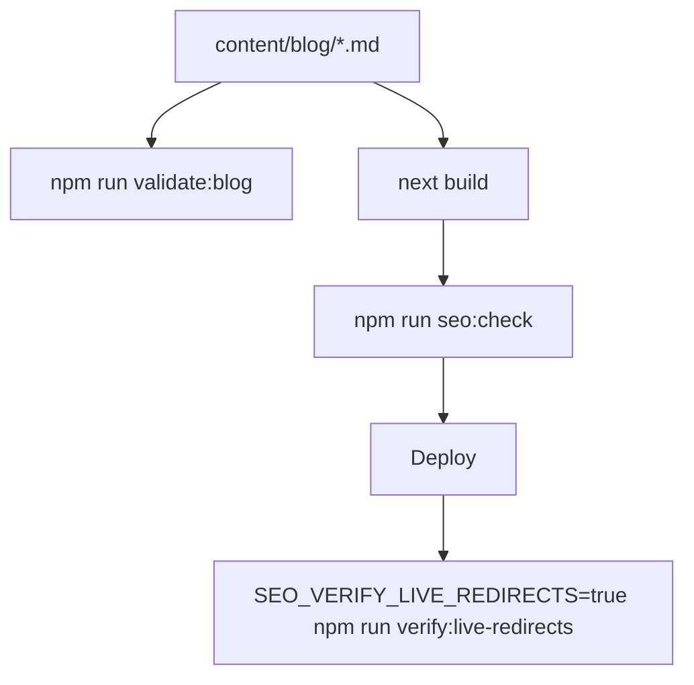

# Shri Gajanan Maharaj Sansthan Website

Official Next.js website for Shri Gajanan Maharaj Sansthan with:

- SEO-first page metadata and structured data
- location + booking conversion flows
- markdown-driven devotional/blog content cluster
- strict automated SEO quality gates

## Quick Start

1. Install dependencies:

```bash
npm ci
```

2. Copy env template and update values:

```bash
cp .env.example .env
```

3. Run local dev server:

```bash
npm run dev
```

Open: `http://localhost:3000`

---

## Environment Variables

Use `.env.example` as the single source template.

Critical variables:

```env
NEXT_PUBLIC_SITE_URL=https://www.shrigajananmaharajsanstan.com
NEXT_PUBLIC_GA_MEASUREMENT_ID=G-XXXXXXXXXX
NEXT_PUBLIC_DEBUG_SEO=false
BUILD_STANDALONE=false
SEO_ENABLE_APP_HOST_REDIRECTS=false
SEO_VERIFY_LIVE_REDIRECTS=false
```

### Canonical-host safety note

`SEO_ENABLE_APP_HOST_REDIRECTS` is disabled by default to avoid host bounce loops when deployment platform redirects are configured separately.  
Enable it only when DNS/platform redirect policy is confirmed to match your canonical host.

---

## SEO Verification Commands

### Full gate

```bash
npm run seo:check
```

### Strict gate (used by CI)

```bash
npm run seo:check:strict
```

### Live redirect loop check (opt-in)

```bash
SEO_VERIFY_LIVE_REDIRECTS=true npm run verify:live-redirects
```

---

## SEO/Content pipeline flow



---

## Useful Docs

- `SEO_QUICKSTART.md`
- `SEO_IMPLEMENTATION_COMPLETE.md`
- `docs/SEO_SETUP_GUIDE.md`
- `docs/SEO_TECHNICAL_IMPLEMENTATION.md`
- `docs/SEO_ROLLOUT_VERIFICATION_REPORT.md`
- `docs/SEO_MEDIA_ASSET_INVENTORY.md`
- `docs/SEO_POST_DEPLOY_SMOKE_CHECKLIST.md`

---

## Deployment Reminder

After each deployment:

1. run live host redirect check
2. verify `/robots.txt` and `/sitemap.xml`
3. inspect homepage canonical + OG tags
4. review Google Search Console coverage changes
