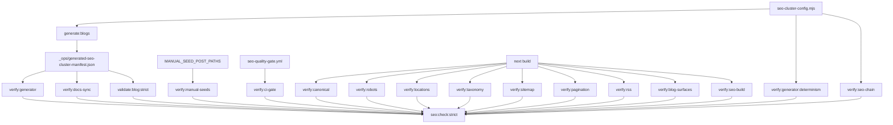

# Module: scripts

**Short:** Operational SEO/content scripts for generation, validation, and build-surface verification.

## Purpose

This module provides deterministic content generation and strict SEO quality gates used both locally and in CI.

## Core scripts

- `generate-seo-blog-cluster.mjs` — deterministic markdown cluster generator.
- `validate-blog-content.mjs` — strict markdown/frontmatter/link/coverage validator.
- `verify-generated-cluster-manifest.mjs` — generator-manifest distribution/integrity verifier.
- `verify-generated-content-determinism.mjs` — regenerates in temp root and compares manifest/checksum determinism.
- `verify-manual-seed-posts.mjs` — validates manual seed anchors excluded from generated manifest ownership.
- `verify-seo-command-chain.mjs` — enforces `seo:check` / `seo:check:strict` step order invariants.
- `verify-ci-seo-gate.mjs` — validates GitHub Actions SEO-gate workflow invariants.
- `verify-seo-docs-sync.mjs` — validates SEO inventory claims/command references across docs.
- `verify-canonical-consistency.mjs` — canonical host/uniqueness verifier on prerendered SEO pages.
- `verify-robots-policy.mjs` — robots directives/host/sitemap policy verifier.
- `verify-location-seo-surfaces.mjs` — geo/meta/schema checks for location pages.
- `verify-taxonomy-prerender.mjs` — taxonomy and pagination prerender presence checks.
- `verify-sitemap-coverage.mjs` — sitemap inventory and expected URL presence checks.
- `verify-blog-pagination-links.mjs` — archive prev/next navigation integrity checks.
- `verify-rss-feed.mjs` — RSS route/output/item-count coverage checks.
- `verify-blog-post-seo-surfaces.mjs` — all blog post prerender canonical/meta/schema checks.
- `verify-seo-build.mjs` — critical route canonical/meta/schema/keyword fragment checks.

## Shared configuration

- `seo-cluster-config.mjs`
  - Single source of truth for generated cluster targets.
  - Reused by generation and validation/verifier scripts to prevent drift.

## Pipeline flow

## Operational notes

- All scripts emit structured console diagnostics for easier CI debugging.
- Scripts include top-level error guards (try/catch) and fail with structured error payloads for CI readability.
- `seo:check:strict` is the canonical quality gate command used by CI workflow.
- If cluster sizing changes, update `seo-cluster-config.mjs` first, then regenerate content.
- Generator/validator/verifier use manifest config fingerprint checks to fail fast on stale generated content.
- Generator writes manifest version + per-file SHA-256 checksums; verifier validates checksum integrity to detect manual drift.
- Checksum map keyset validation ensures manifest checksums exactly match generated file inventory (no missing/extra entries).
- Volatile timestamp fields are blocked in manifest format to keep generation idempotent across repeated runs.
- Determinism verifier runs generator in isolated temp root and compares resulting checksums to live manifest.
- Determinism verifier captures generator stdout/stderr snippets and enforces temp-run timeout for actionable failure diagnostics.
- Manifest generatedFiles path-policy and lexicographic-order checks enforce deterministic file inventory formatting.
- Managed namespace ownership checks ensure generated folders contain only manifest-owned files + explicit manual seed anchors.
- Manual seed verifier enforces seed-post quality and ensures seeds remain excluded from generated manifest ownership.
- Blog post surface verifier enforces per-post prerender canonical/meta/schema guarantees for all markdown slugs.
- Command-chain verifier fails fast when strict SEO gate ordering drifts in package scripts.
- Command-chain verifier also confirms every referenced `npm run <script>` step exists in package scripts.
- Command-chain verifier also enforces no duplicate steps, `npm run` step formatting, and parity between check/strict chains (except final validation step).
- CI-gate verifier fails fast when workflow no longer runs strict gate or required workflow invariants drift.
- Generator verifier checks generated-file frontmatter invariants (slug, category, relatedSlugs minimum, location namespace rules, brand fragment presence).
- Validator includes inbound blog-link graph checks to prevent orphaned generated posts.
- Validator also enforces minimum outbound blog links on generated posts for better crawl continuity.
