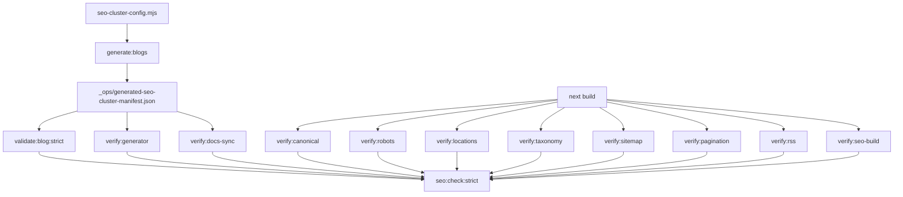

# Module: scripts

**Short:** Operational SEO/content scripts for generation, validation, and build-surface verification.

## Purpose

This module provides deterministic content generation and strict SEO quality gates used both locally and in CI.

## Core scripts

- `generate-seo-blog-cluster.mjs` — deterministic markdown cluster generator.
- `validate-blog-content.mjs` — strict markdown/frontmatter/link/coverage validator.
- `verify-generated-cluster-manifest.mjs` — generator-manifest distribution/integrity verifier.
- `verify-seo-docs-sync.mjs` — validates SEO inventory claims/command references across docs.
- `verify-canonical-consistency.mjs` — canonical host/uniqueness verifier on prerendered SEO pages.
- `verify-robots-policy.mjs` — robots directives/host/sitemap policy verifier.
- `verify-location-seo-surfaces.mjs` — geo/meta/schema checks for location pages.
- `verify-taxonomy-prerender.mjs` — taxonomy and pagination prerender presence checks.
- `verify-sitemap-coverage.mjs` — sitemap inventory and expected URL presence checks.
- `verify-blog-pagination-links.mjs` — archive prev/next navigation integrity checks.
- `verify-rss-feed.mjs` — RSS route/output/item-count coverage checks.
- `verify-seo-build.mjs` — critical route canonical/meta/schema/keyword fragment checks.

## Shared configuration

- `seo-cluster-config.mjs`
  - Single source of truth for generated cluster targets.
  - Reused by generation and validation/verifier scripts to prevent drift.

## Pipeline flow

## Operational notes

- All scripts emit structured console diagnostics for easier CI debugging.
- Scripts include top-level error guards (try/catch) and fail with structured error payloads for CI readability.
- `seo:check:strict` is the canonical quality gate command used by CI workflow.
- If cluster sizing changes, update `seo-cluster-config.mjs` first, then regenerate content.
- Generator/validator/verifier use manifest config fingerprint checks to fail fast on stale generated content.
- Validator includes inbound blog-link graph checks to prevent orphaned generated posts.
- Validator also enforces minimum outbound blog links on generated posts for better crawl continuity.
