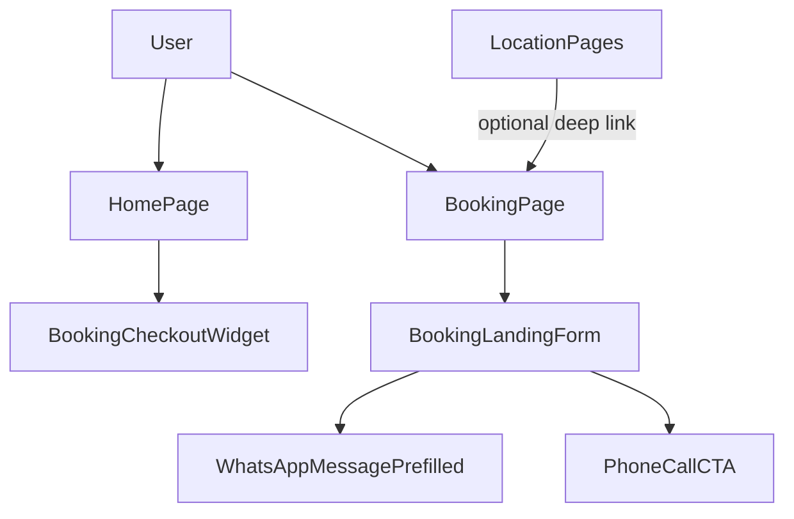

# Module: booking

**Short:** Lightweight booking intent flows (WhatsApp + phone).

**Purpose:** Help devotees send complete booking enquiries (location, dates, guests) to the Sansthan office using WhatsApp or call, without implementing a full online booking/payment system.

**Entry points:**
- `src/app/booking/page.tsx`
- `src/app/page.tsx` (homepage quick checkout)

**Files:**
- `components/BookingCheckoutWidget.tsx` — homepage “Check Out” widget (location → reveal WhatsApp/Call)
- `components/BookingLandingForm.tsx` — booking page form that generates a WhatsApp message and call CTA
- `MODULE_DOC.md` — this document

**Data sources:**
- `src/data/sansthan-data.ts` — locations list
- `src/data/contact.ts` — booking helpline + WhatsApp link
- `src/data/faq.ts` — booking FAQs for SEO rich results

**Flow diagram:**

**Behaviors:**
- **WhatsApp-first**: generates a pre-filled WhatsApp message to reduce back-and-forth and speed up confirmations.
- **Optional query preselect**: supports `/booking?location=<id>` to preselect a location.
- **No booking confirmation**: all confirmations are handled by the Sansthan office (availability + rules).
- **Analytics**: tracks WhatsApp/phone clicks using `src/lib/analytics/events.ts`.

**Env vars:**
- `NEXT_PUBLIC_SITE_URL` (recommended): ensures correct canonical URLs for SEO.
- `NEXT_PUBLIC_GA_MEASUREMENT_ID` (optional): enables GA4 tracking in production.

**Tests:**
- Not yet added.

**Change-log:**
- 2026-02-13: Added lightweight `/booking` landing page and `BookingLandingForm` (WhatsApp/call based).
- 2026-02-13: Updated booking mobile/WhatsApp number to 9217691636 in `src/data/contact.ts` (single source of truth).
- 2026-02-13: Removed all other phone numbers; site now uses only 9217691636 for contact (single number everywhere).

