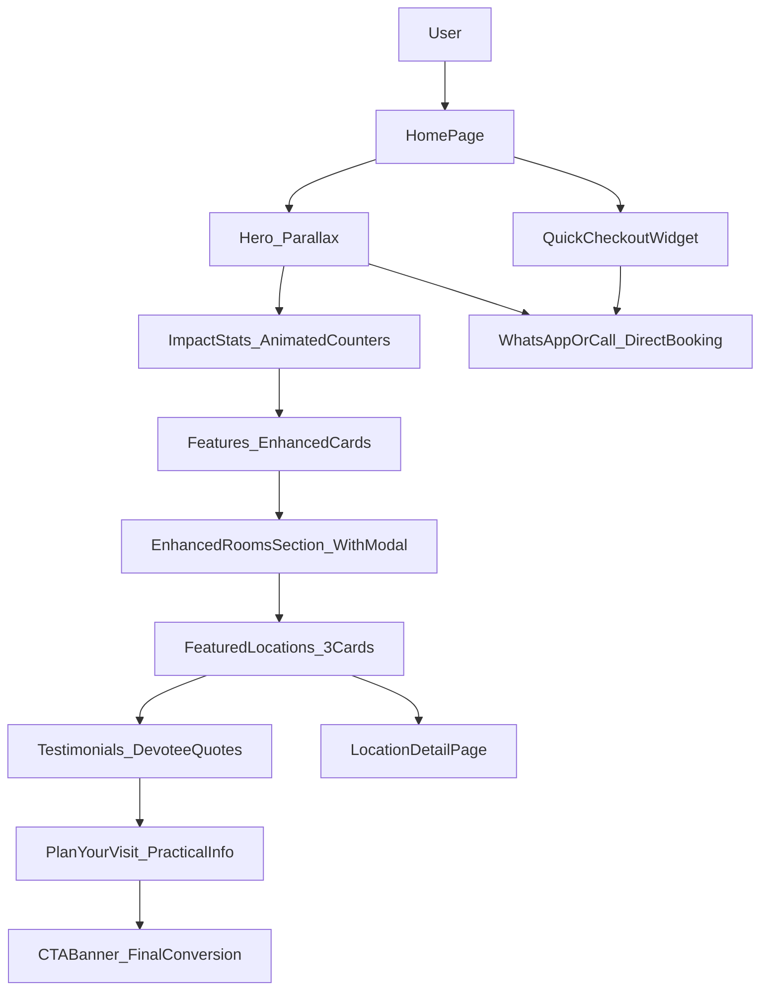

# Module: info

**Short:** Premium multi-section home page with rich storytelling and visual appeal.

**Purpose:** Present a premium spiritual first impression for devotees with comprehensive information, visual storytelling, social proof, and clear pathways to booking and exploration.

**Entry points:**
- `src/app/page.tsx`

**Files:**
- `components/Hero.tsx` — premium hero with parallax, enhanced animations, decorative elements
- `components/RoomTypesSection.tsx` — “rooms” style section (no pricing) with location filter + WhatsApp/Call CTAs
- `components/EnhancedRoomsSection.tsx` — interactive room booking section with modal details, pricing, and direct booking CTAs
- `components/ImpactStats.tsx` — animated statistics showcasing Sansthan's service impact
- `components/Features.tsx` — enhanced services grid with hover effects and gradient overlays
- `components/FeaturedLocations.tsx` — showcase of main pilgrimage destinations
- `components/Testimonials.tsx` — devotee experiences with elegant quote styling
- `components/PlanYourVisit.tsx` — practical visit planning information (timings, transport, tips)
- `components/CTABanner.tsx` — final conversion CTA with premium gradient
- `components/SectionDivider.tsx` — reusable decorative dividers (3 variants)
- `MODULE_DOC.md` — this document

**Data sources:**
- `src/data/testimonials.ts` — devotee testimonials
- `src/data/visit-info.ts` — darshan timings, transport, visit tips
- `src/data/sansthan-data.ts` — locations data
- `src/data/rooms.ts` — room types with pricing and features

**Flow diagram:**

**Behaviors:**
- **Premium visuals**: Parallax effects, gradient overlays, animated counters, staggered reveals
- **Storytelling flow**: Impact → Services → Rooms → Locations → Testimonials → Planning → Action
- **Interactive modals**: Room details displayed in overlay with escape key and backdrop click support
- **Direct booking focus**: Hero section emphasizes WhatsApp and phone CTAs only, no secondary navigation
- **Performance**: Next `Image` optimization, lazy animations (viewport-once), efficient motion
- **Mobile-first**: All sections fully responsive with proper spacing and touch targets
- **Accessibility**: Proper heading hierarchy, ARIA labels, keyboard navigation, modal focus management

**Visual elements:**
- Decorative section dividers with 3 variants (default, ornate, minimal)
- Floating gradient orbs in backgrounds
- Gold accent highlights and traditional motifs
- Smooth hover effects and micro-interactions
- Consistent rounded corners (2xl for premium feel)

**Dependencies:**
- **UI primitives**: `src/components/ui/*`
- **Libraries**: `next/image`, `framer-motion`, `lucide-react`
- **Data**: testimonials, visit-info, sansthan-data, contact

**Env vars:**
- `NEXT_PUBLIC_SITE_URL`: recommended for production OG/sitemap URLs

**Tests:**
- Not yet added.

**Change-log:**
- 2026-02-05: Complete premium redesign with 7 new sections, parallax hero, animated stats, testimonials, visit planning info, and enhanced features grid.
- 2026-02-06: Added hero WhatsApp/Call CTAs, homepage quick checkout widget, and “Room Types” cards section (no pricing).
- 2026-02-06: Updated hero section background image to 'WhatsApp Image 2026-02-05 at 14.16.35.jpeg'.
- 2026-02-12: Integrated EnhancedRoomsSection with modal functionality, pricing display, and direct booking CTAs. Added room images and pricing data from reference dharmashala site. Replaced RoomTypesSection with EnhancedRoomsSection on home page. Added modal overlay styles to globals.css for interactive room details. Analytics tracking for WhatsApp/Call clicks from room modals.
- 2026-02-12: Replaced site-wide motto "Gan Gan Ganaat Bote" with "Jai Gajanan Maharaj" in Hero, Footer, Navbar, Testimonials, RoomTypesSection, EnhancedRoomsSection, error/not-found pages, and WhatsApp message templates.
- 2026-02-12: Reordered home page sections to show rooms before locations for better conversion flow. Simplified hero section by removing secondary navigation links ("Check availability", "Fill detailed booking request", "Explore locations"), keeping only direct WhatsApp and phone booking CTAs for cleaner UX and stronger conversion focus.
- 2026-02-12: Removed detailed booking system completely from website. Deleted /booking page, BookingWizard, VerticalDatePicker, and booking schema. Removed all "Fill detailed booking request" links from Hero, BookingCheckoutWidget, Footer, Navbar, RoomTypesSection, FeaturedLocations, CTABanner, location pages, and LocationCard. Updated all booking CTAs to direct WhatsApp/Call links only. Removed /booking from sitemap. Simplified user journey to WhatsApp and phone booking exclusively for better conversion and reduced complexity.
- 2026-02-13: Reintroduced a lightweight `/booking` landing page (WhatsApp/Call intent form + FAQ) and re-added it to sitemap/navigation. Unified canonical site URL handling across metadata/robots/sitemap/JSON-LD and added placeholder image routes to prevent 404s until real assets are added.
