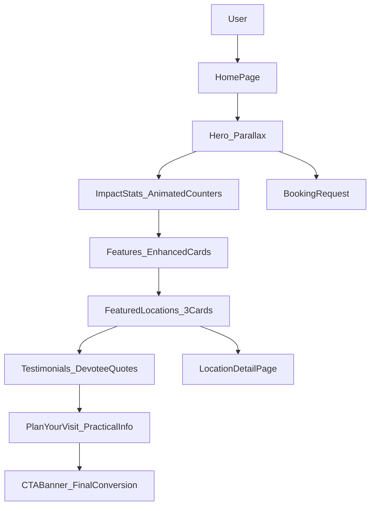

# Module: info

**Short:** Premium multi-section home page with rich storytelling and visual appeal.

**Purpose:** Present a premium spiritual first impression for devotees with comprehensive information, visual storytelling, social proof, and clear pathways to booking and exploration.

**Entry points:**
- `src/app/page.tsx`

**Files:**
- `components/Hero.tsx` — premium hero with parallax, enhanced animations, decorative elements
- `components/ImpactStats.tsx` — animated statistics showcasing Sansthan's service impact
- `components/Features.tsx` — enhanced services grid with hover effects and gradient overlays
- `components/FeaturedLocations.tsx` — showcase of main pilgrimage destinations
- `components/Testimonials.tsx` — devotee experiences with elegant quote styling
- `components/PlanYourVisit.tsx` — practical visit planning information (timings, transport, tips)
- `components/CTABanner.tsx` — final conversion CTA with premium gradient
- `components/SectionDivider.tsx` — reusable decorative dividers (3 variants)
- `MODULE_DOC.md` — this document

**Data sources:**
- `src/data/testimonials.ts` — devotee testimonials
- `src/data/visit-info.ts` — darshan timings, transport, visit tips
- `src/data/sansthan-data.ts` — locations data

**Flow diagram:**

**Behaviors:**
- **Premium visuals**: Parallax effects, gradient overlays, animated counters, staggered reveals
- **Storytelling flow**: Impact → Services → Locations → Testimonials → Planning → Action
- **Performance**: Next `Image` optimization, lazy animations (viewport-once), efficient motion
- **Mobile-first**: All sections fully responsive with proper spacing and touch targets
- **Accessibility**: Proper heading hierarchy, ARIA labels, keyboard navigation

**Visual elements:**
- Decorative section dividers with 3 variants (default, ornate, minimal)
- Floating gradient orbs in backgrounds
- Gold accent highlights and traditional motifs
- Smooth hover effects and micro-interactions
- Consistent rounded corners (2xl for premium feel)

**Dependencies:**
- **UI primitives**: `src/components/ui/*`
- **Libraries**: `next/image`, `framer-motion`, `lucide-react`
- **Data**: testimonials, visit-info, sansthan-data, contact

**Env vars:**
- `NEXT_PUBLIC_SITE_URL`: recommended for production OG/sitemap URLs

**Tests:**
- Not yet added.

**Change-log:**
- 2026-02-05: Complete premium redesign with 7 new sections, parallax hero, animated stats, testimonials, visit planning info, and enhanced features grid.
