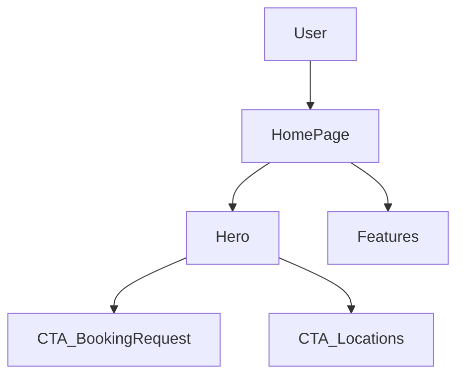

# Module: info

**Short:** Home page hero and “Services” section content.

**Purpose:** Present a premium spiritual first impression for devotees, highlight key Sansthan services, and guide users to locations and booking requests.

**Entry points:**
- `src/app/page.tsx`

**Files:**
- `components/Hero.tsx` — premium hero with background image + primary CTAs
- `components/Features.tsx` — “Sansthan Services” grid with icons + scroll reveal
- `MODULE_DOC.md` — this document

**Flow diagram:**

**Behaviors:**
- **Premium visuals**: serif headings, spiritual palette (saffron/maroon/gold), subtle background pattern via global CSS.
- **Performance**: hero background uses Next `Image` (priority) to improve LCP.
- **Motion**: scroll reveal animations via `src/components/ui/scroll-reveal.tsx` (viewport-once).

**Dependencies:**
- **UI primitives**: `src/components/ui/*`
- **Libraries**: `next/image`, `framer-motion`, `lucide-react`

**Env vars:**
- None required.

**Tests:**
- Not yet added.

**Change-log:**
- 2026-02-05: Converted hero background to Next `Image` and aligned CTA structure for accessibility.

