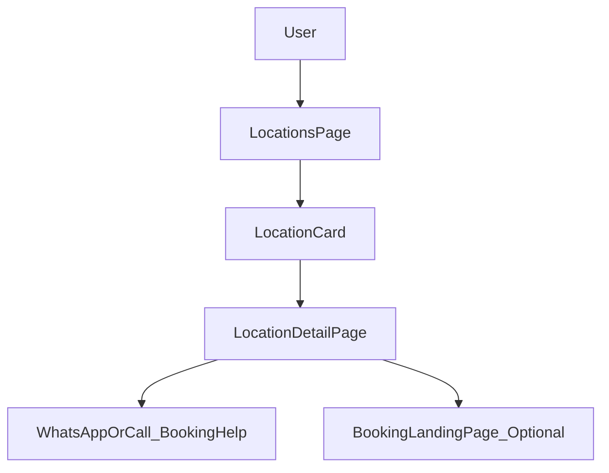

# Module: locations

**Short:** Locations directory + detail pages for Sansthan accommodations.

**Purpose:** Provide devotees a clear, mobile-friendly directory of Sansthan-managed accommodation locations (facilities, amenities, contacts) with a direct path to the booking request flow.

**Entry points:**
- `src/app/locations/page.tsx`
- `src/app/locations/[id]/page.tsx`

**Files:**
- `components/LocationCard.tsx` — location preview card with “Details” and “Book” CTAs
- `components/AmenityList.tsx` — amenity rendering for detail pages
- `MODULE_DOC.md` — this document

**Data source:**
- `src/data/sansthan-data.ts` — `sansthanLocations` (images, facilities, amenities, contacts)

**Flow diagram:**

**Behaviors:**
- **Mobile-first**: grid collapses to one column; room types table scrolls horizontally on small screens.
- **Performance**: uses Next `Image` for cards and the primary detail image to reduce layout shift.
- **Pre-rendered routes**: all known locations are statically generated for better crawlability and faster loads.
- **Booking CTA**: primary CTAs use WhatsApp/Call. The `/booking` landing page supports `?location=<id>` to preselect a location when linking from location pages.

**Dependencies:**
- **Data**: `src/data/sansthan-data.ts`
- **UI primitives**: `src/components/ui/*`
- **Libraries**: `next/image`, `lucide-react`

**Env vars:**
- None required.

**Tests:**
- Not yet added.

**Change-log:**
- 2026-02-05: Upgraded location images to Next `Image`, improved mobile table rendering, and aligned CTAs with booking request flow.
- 2026-02-13: All location contacts now use single number 9217691636 (via `src/data/contact.ts`).
- 2026-02-13: Pre-rendered all location detail pages (`generateStaticParams` + `dynamicParams=false`) and aligned booking guidance with the lightweight `/booking` landing page.

