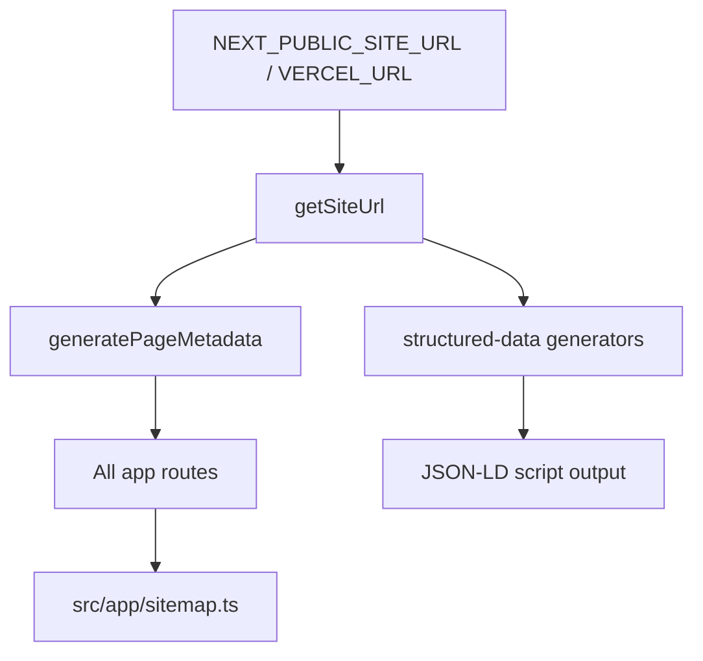

# Module: lib/seo

**Short:** Central SEO engine for metadata, schema, keywords, canonical URL, and geo enrichment.

## Purpose

Provide reusable SEO primitives used across all routes:

- page metadata generation (`metadata.ts`)
- keyword strategy constants (`constants.ts`)
- canonical host/site URL resolution (`site-url.ts`)
- JSON-LD schema generation (`structured-data.ts`)
- geo coordinate helpers (`geo-data.ts`)

## Core files

- `constants.ts` — keyword clusters, brand/location variants, and keyword dedupe helper.
- `metadata.ts` — page metadata builders (including location geo meta support).
- `site-url.ts` — canonical origin resolver.
- `structured-data.ts` — Organization, WebSite, PlaceOfWorship, LocalBusiness, LodgingBusiness, FAQ, Breadcrumb, Article, CollectionPage schemas.
- `geo-data.ts` — location coordinates and geotag helpers.

## Canonical and metadata flow

## Logging / diagnostics

- Blog ingestion warns on metadata quality issues through `blog-seo-warning` logs.
- Invalid canonical URL environment values emit `seo-config-warning` at config load time.

## Changelog

- **2026-02-05**: Initial SEO helper modules and schema generation added.
- **2026-02-15**: Expanded keyword variant coverage for Shri/Shree/Sri + Sansthan/Sanstan permutations and strengthened page metadata keyword mapping.
- **2026-02-15**: Canonical redirect handling hardened to redirect alternate host → configured canonical host.
